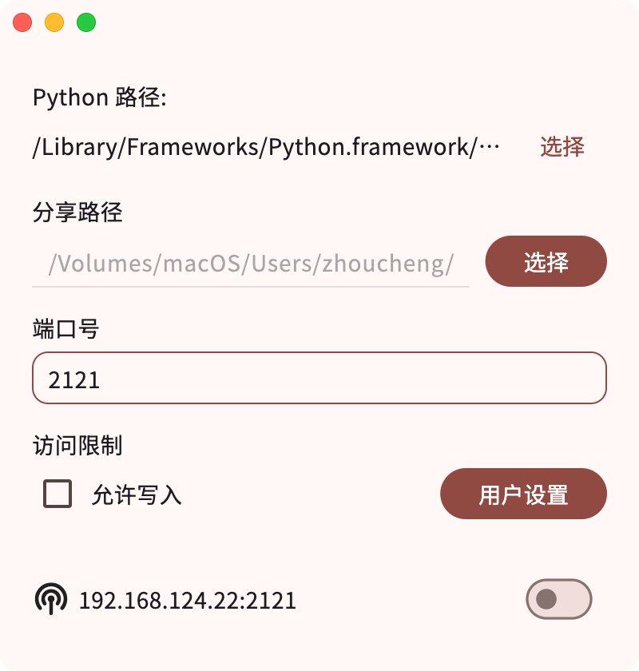

# pyftp GUI


## 截图



## 使用方法

**不要在运行服务的过程中直接关闭软件!!!**  
**在停止服务之后再关闭软件!!!**

### 在你的计算机/Mac或者需要作为服务器的设备上

1. 你需要安装Python3，建议加入到PATH（系统的环境变量）
2. 使用命令安装pyftpdlib：
    ```bash
    pip install pyftpdlib
    # 如果你使用的是macOS系统，那么很有可能是:
    pip3 install pyftpdlib
    ```
3. 打开本软件
4. 如果你看到第一个输入框（Python程序的路径）没有自动填写，务必手动选取（理论上如果你添加到了环境变量，这里会自动填写的）
5. 在第二个输入框右边点击按钮选取你要分享的目录
6. 点击开关即可启动服务

### 在你的移动设备或者其他需要访问的设备上

**以下涉及到的软件是经过测试的，当然你可以使用其它的软件来连接到FTP服务器**

- iOS设备: `Documents`, `ES文件管理浏览器`
- Android设备: `ES文件管理浏览器`
- Windows设备: 在文件管理器的路径中直接输入:`ftp://<IP地址>:<端口号>/`即可（你可以在软件的左下角看到IP地址+端口号）
- Mac: 在访达的菜单栏中选择前往->连接到服务器，输入FTP地址即可

## Q&A

> 为什么没有Mac版?
>> 目前个人使用的设备是Windows设备，如果你需要macOS版本，你可以自行尝试，难度并不大

> 点击启动之后无法连接到服务器?
>> 确保你已经安装了pyftpdlib，并且端口没有被占用

> 软件崩溃了?
>> 大概率是端口被占用了

> 端口被占用了怎么办?
>> 你可以通过命令行查找占用的进程，把它kill掉，如果你不知道怎么操作，重启也是个解决方法

## 更新日志

- ### v1.2.5 (2024/7/19)
  - 修复带有空格路径崩溃的问题
  - 修复找不到进程崩溃的问题

<details>
<summary>过往的版本</summary>

- ### v1.2.4 (2024/6/16)
  - 启动服务前检查路径是否合法
  - 提高软件运行效率

- ### v1.2.3 (2024/5/26)
  - 添加没有配置环境变量的提示
  - 修复获取ip地址的问题
  - 修复Python路径存在特殊字符的问题

- ### v1.2.2 (2024/5/23)
  - 添加记住上一次的表单内容

- ### v1.2.1 (2024/5/17)
  - 添加在没有停止运行关闭窗口的提示

- ### v1.2.0 (2024/5/15)
  - 添加允许写入权限
  - 添加通过用户名和密码访问
  - 修复运行中修改表单的问题

- ### v1.1.0 (2024/5/14)
  - 更新到Flutter 3.19
  - 现在可以自动获取Python程序路径了

- ### v1.0.1
  - 第一个正式版本

</details>